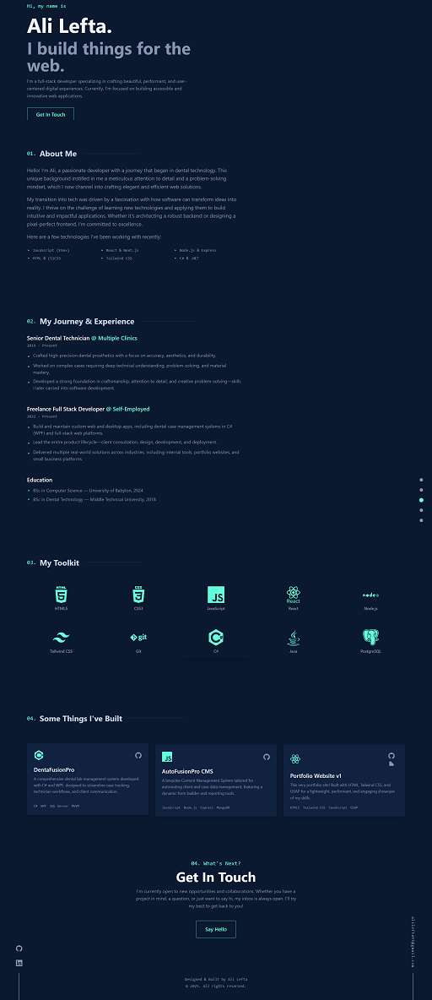

# Ali Lefta - Full Stack Developer Portfolio



<!-- Ideally, add a screenshot to your repo and link it here -->
<!-- Example: ./src/assets/screenshot.png -->

This repository contains the source code for my personal portfolio website, showcasing my skills, projects, and journey as a Full Stack Developer. The website is built with pure HTML, CSS (Tailwind CSS via CDN), and JavaScript, featuring various animations and interactive elements powered by GSAP.

**Live Site:** [https://alilefta.github.io/Portfolio_V1/](https://alilefta.github.io/Portfolio_V1/)

<!-- Replace with your actual GitHub Pages link -->

---

## ✨ Features

-   **Responsive Design:** Adapts to all screen sizes, from mobile to desktop.
-   **Interactive UI:** Smooth animations, custom cursor, project card tilt effects, and typing animations using GSAP.
-   **Single Page Application (SPA) feel:** Smooth scrolling navigation and modal popups for project details.
-   **Loader & Progress Bar:** Enhances user experience during page load and scroll.
-   **Detailed Sections:**
    -   Hero section with a dynamic typing effect.
    -   About Me.
    -   Experience (highlighting transition from Dental Technology and freelance work).
    -   Skills showcase with icons.
    -   Project gallery with clickable cards and detailed modals.
    -   Contact information.
-   **PWA Ready:** Includes a Web App Manifest (`manifest.json`) for "Add to Home Screen" capability.
-   **(Planned/Implemented) Multi-language Support:** English (default) and Arabic versions with RTL support.
-   **(Planned/Implemented) Dark/Light Theme Toggle:** User-selectable theme preference persisted in localStorage.
-   **Clean Code:** Semantic HTML and well-organized CSS/JavaScript.

---

## 🛠️ Technologies Used

-   **HTML5:** Semantic structure.
-   **CSS3:** Custom styling and layout.
    -   **Tailwind CSS (v3 via CDN):** Utility-first CSS framework for rapid UI development.
-   **JavaScript (ES6+):** For interactivity, animations, and dynamic content.
    -   **GSAP (GreenSock Animation Platform):** For all animations (hero text, section reveals, preloader, cursor, etc.).
    -   **ScrollTrigger (GSAP Plugin):** For scroll-based animations.
-   **Devicon:** For technology icons in the skills and projects sections.
-   **Google Fonts:** For typography (e.g., Noto Sans Arabic for Arabic version).
-   **GitHub Pages:** For hosting the static website.

---

## 🚀 Setup and Local Development

This project is designed to be very simple to run as it primarily uses CDNs for its dependencies.

1.  **Clone the repository:**
    ```bash
    git clone https://github.com/yourusername/your-repo-name.git
    cd your-repo-name
    ```
2.  **Open `index.html` (or `index-ar.html`) in your browser:**
    -   Simply double-click the `index.html` file, or use a live server extension if you have one in your code editor (like VS Code's "Live Server").

No build steps are required due to the use of CDNs for Tailwind CSS and GSAP.

---

## 📂 Project Structure

.
├── index.html # Main English version
├── index-ar.html # Arabic version (if implemented)
├── src/
│ ├── assets/
│ │ ├── favicon/ # Favicon files (fav.ico, fav.png, etc.)
│ │ ├── projects/ # Project images for modals
│ │ └── screenshot.png # Example screenshot for README
│ ├── styles.css # Custom CSS rules, RTL overrides
│ └── manifest.json # Web App Manifest for PWA features
├── README.md # This file
└── resume.pdf # Your resume PDF (linked from the site)

---

## 🎨 Design and Inspiration

The design aims for a modern, clean, and professional look, inspired by contemporary developer portfolios. Key design elements include:

-   Dark theme as the primary (with a planned light theme).
-   Accent color: Teal/Green (`#64ffda`).
-   Monospaced fonts for code-related text and numbered headings.
-   Visual hierarchy and ample whitespace for readability.
-   Subtle animations to guide the user and add delight without being distracting.
-   Inspiration drawn from portfolios like Brittany Chiang's for elements like numbered headings and fixed social links.

---

## 💡 Future Enhancements (Potential To-Do)

-   [ ] Complete Dark/Light theme implementation across all elements.
-   [ ] Refine Arabic translations and RTL styling.
-   [ ] Add more projects to the gallery.
-   [ ] Implement a contact form (would require a backend service like Formspree or Netlify Forms for a static site).
-   [ ] Write blog posts or case studies for key projects and link them.
-   [ ] Further performance optimizations (e.g., image optimization).

---

## 👤 Author

-   **Ali Lefta**
    -   GitHub: [@yourusername](https://github.com/yourusername)
    -   LinkedIn: [linkedin.com/in/yourlinkedinprofile](https://linkedin.com/in/yourlinkedinprofile)
    -   Email: [alilefta95@gmail.com](mailto:alilefta95@gmail.com)

---

## 🙏 Acknowledgements

-   GreenSock (GSAP) for the amazing animation library.
-   Tailwind CSS team for the utility-first CSS framework.
-   Devicon authors for the technology icons.
-   Community for design inspiration.

---

## 📄 License

This project is open source. Feel free to use the code as inspiration for your own portfolio. If you do, an attribution or a shout-out would be appreciated but is not required.
(Consider adding a specific license if you wish, e.g., MIT License. If not, it defaults to standard copyright.)
